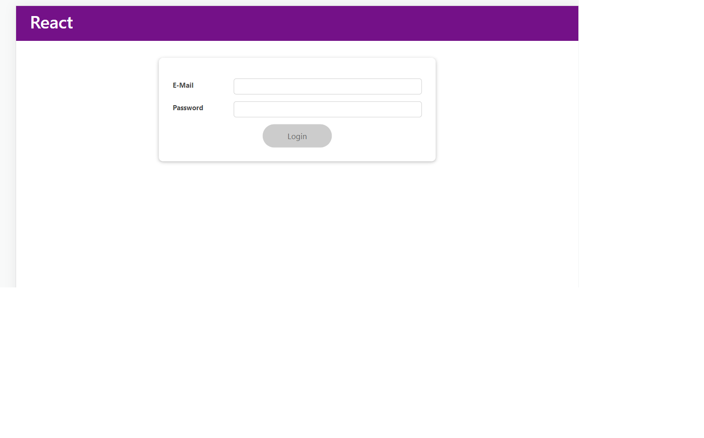
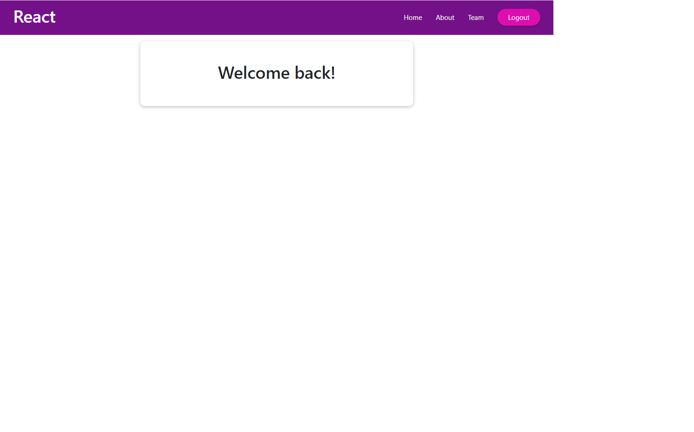
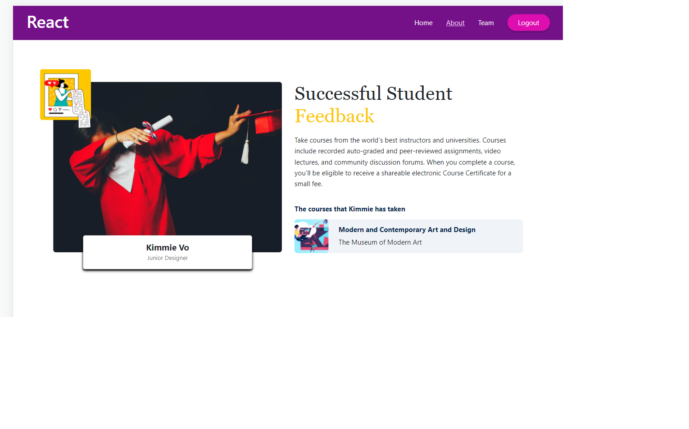
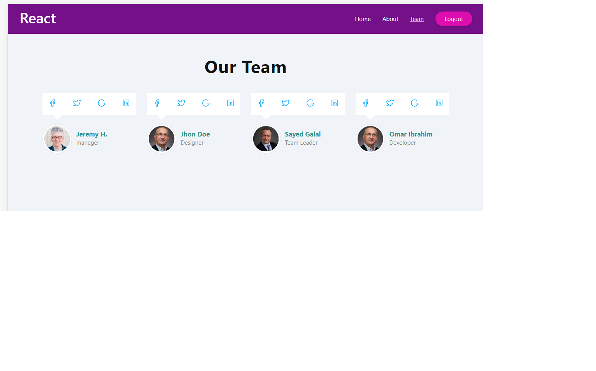

# Getting Started with Create React App

This project was bootstrapped with [Create React App](https://github.com/facebook/create-react-app).

## Pages 

1- Login
2- Home
3- About
4- Team
## Components
About
Home
Login
MainHeader
Teams
Navigation
## Reusable components

Card
Button

##  1-Login Page 
A component with form for submitting user Email and Password

## Features 

1- Email Validation
2- Password Validation 
3-Form Validation 
4- Redirect the user to the Home component when the data is correct 
5- useEffect Hook to handle sideEffects
6- using the reusable Card component to wrap the form inside it

________________________________________________

## 2- Home Page 

-after the user login in successfully he will be redirect to the Home page 
-we handle this step in the Home Component with a very simple UI to describe the process 

-we note here in the attached image the navigation bar links have 2 cases 
1- if the user is not logged in it will not appear
2- after the user logged in the links appears 

________________________________________________

## About Page 

here we represent another simple UI in the About component and link it to the about navigation link which will easily can be reached by clicking on the (about) Link 
- here we apply the concept of the SPA 

_________________________________________________

## Teams Page 

- and finally the third UI is a simple Team page that display dummy team members data 

